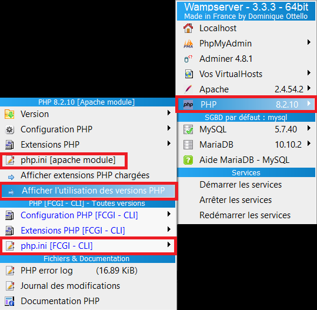

# Envoyer des mails avec WAMP
Envoyer des mails en php depuis wamp est impossible de base.
Il faut pour cela créer un (faux) serveur de mail, pour que la fonction [`mail()`](https://www.php.net/manual/fr/function.mail.php) native de php puisse marcher.

## Installer Sendmail  
<details>
  <summary>lire l'installation de Sendmail</summary>


1. Installer un émulateur d'envoi, qui permet d'envoyer les mails grâce à une adresse existante :

	- Il faut télécharger ce zip : https://github.com/sendmail-tls1-2/main

	- Je mettrai le zip directement dans ce repo.
	
	ensuite, faire comme la doc le dit :

	1. Dézipper le dossier dans c://wamp/sendmail/
	2. Il va vous falloir une adresse mail pour faire fonctionner sendmail. Si vous souhaitez utiliser une adresse gmail, il vous faudra un mot de passe d'application. Pour cela, suivez [ce tuto](https://www.journaldufreenaute.fr/comment-creer-des-mots-de-passe-specifiques-a-une-application-dans-gmail/), [ou celui-ci](https://support.google.com/mail/answer/185833?hl=fr).
	3. Modifier le fichier sendmail.ini comme suit :

    ```
		[sendmail] 
		smtp_server=Adresse.serveur.fr
		smtp_port=587
		smtp_ssl=tls
		default_domain=Domaine.fr
		error_logfile=error.log
		auth_username=adresse@mail.fr
		auth_password=MotdePasse
		pop3_server= 
		pop3_username= 
		pop3_password= 
		force_sender=adresse@mail.fr
		force_recipient= 
		hostname=
    ```
	4. Ensuite, cliquer sur l'icone de wamp, -> PHP -> php.ini.\
    *Vous pouvez voir les différentes versions de PHP que vous utilisez en cliquant sur* wamp -> PHP -> Afficher l'utilisation des versions PHP :
    
    Vous modifierez les différents `php.ini` comme suit :
    
    ```
                [mail function]
                ; For Win32 only.
                ; http://php.net/smtp
    commenter	; SMTP = localhost
                ; http://php.net/smtp-port
    commenter	; smtp_port = 25

                ; For Win32 only.
                ; http://php.net/sendmail-from
    commenter	; sendmail_from ="admin@wampserver.invalid"

                ; For Unix only.  You may supply arguments as well (default: "sendmail -t -i").
                ; http://php.net/sendmail-path
    décommenter	sendmail_path = "C:\wamp64\sendmail\sendmail.exe -t -i"

                ; Force the addition of the specified parameters to be passed as extra parameters
                ; to the sendmail binary. These parameters will always replace the value of
                ; the 5th parameter to mail().
                ; mail.force_extra_parameters =

                ; Add X-PHP-Originating-Script: that will include uid of the script followed by the filename
    mettre à On	mail.add_x_header = On

                ; The path to a log file that will log all mail() calls. Log entries include
                ; the full path of the script, line number, To address and headers.
                ; mail.log =
                ; Log mail to syslog (Event Log on Windows).
                ; mail.log = syslog
    ```

	5. Relancer ensuite wamp.

## tester un envoi mail 
```php
<?php
$to      = 'Email@destinataire.fr';
$subject = 'le sujet';
$message = 'Bonjour ! ça fonctionne !';
$headers = 'From: email@envoi.fr' . "\r\n" .
'Reply-To: email@envoi.fr' . "\r\n" .
'X-Mailer: PHP/' . phpversion();

$test = mail($to, $subject, $message, $headers);

if ($test) {
  echo "le mail a bien été envoyé.";
} else{
  var_dump($test); // reverra la valeur de la fonction mail, probablement false. Aller voir dans ce cas le fichier error.log dans C://wamp/sendmail/
}
?>
```

**SI ÇA NE MARCHE TOUJOURS PAS :** \
Aller dans `C:\wamp64\bin\php\php__LA_VERSION_DE_PHP_QU'ON_UTILISE__`
Et faire les mêmes modifs que ci-dessus dans le php.ini.

</details>


## Installer Maildev

<details open>
  <summary>Lire l'installation de maildev</summary>

On peut aussi choisir de faire autrement, avec maildev, qui permet d'attraper tous les mails qui veulent sortir, et de les afficher dans une interface de lecture des mails. Cela permet de simuler l'envoi et la réception des mails, sans se prendre la tête avec les adresses mails renseignées : absolument toutes les adresses mails seront attrapées.

Pour cela je vous propose d'utiliser Maildev.
- https://maildev.github.io/maildev/

### Installation
Nous allons utiliser [npm](https://nodejs.org/en/download/) pour ça. Verifiez que vous l'avez bien installé (avec `npm -v`).

Dans un invite de commande administrateur, tapez cette commande : 
```cmd
npm install -g maildev
```
Afin de s'assurer que les dépendances globales soient bien trouvées sur votre ordinateur, vérifiez si dans les variables d'environnement, dans `path`, il y a bien une ligne qui correspond à cela :

```cmd
C:\Users\[votre nom]\AppData\Roaming\npm
``` 
Une fois que tout cela est bon, vous pouvez utiliser la commande `maildev` depuis partout.

Il nous sera possible d'ajouter des drapeaux à notre commande pour la personnaliser. la liste se trouve [ici](https://maildev.github.io/maildev/#usage).

Par exemple, voici des commande avec drapeaux :
```cmd
# permet de voir l'interface à l'adresse http://localhost:8000
maildev --ip localhost --web 8000

# permet d'écouter le port 25 (par défaut, c'est le port 1025 qui est écouté)

maildev --smtp 25
```

### Paramétrage du fichier `php.ini`
Cliquez gauche sur l'icône de wamp, puis php > php.ini (il peut y en avoir plusieurs, il y a celui du apache module, mais peut-être aussi celui du FCGI-CLI si vous l'utilisez. *Vous pouvez voir les différentes versions de PHP que vous utilisez en cliquant sur* wamp -> PHP -> Afficher l'utilisation des versions PHP)

Modifiez la section comme suit :

```
                [mail function]
                ; For Win32 only.
                ; http://php.net/smtp
                SMTP = localhost
                ; http://php.net/smtp-port
    changer:    smtp_port = 1025

                ; For Win32 only.
                ; http://php.net/sendmail-from
    commenter	; sendmail_from ="admin@wampserver.invalid"

                ; For Unix only.  You may supply arguments as well (default: "sendmail -t -i").
                ; http://php.net/sendmail-path
    commenter	; sendmail_path = "C:\wamp64\sendmail\sendmail.exe -t -i"

                ; Force the addition of the specified parameters to be passed as extra parameters
                ; to the sendmail binary. These parameters will always replace the value of
                ; the 5th parameter to mail().
                ; mail.force_extra_parameters =

                ; Add X-PHP-Originating-Script: that will include uid of the script followed by the filename
    mettre à On	mail.add_x_header = On

                ; The path to a log file that will log all mail() calls. Log entries include
                ; the full path of the script, line number, To address and headers.
                ; mail.log =
                ; Log mail to syslog (Event Log on Windows).
                ; mail.log = syslog
```

Une fois que ce fichier est modifié, pensez à relancer les services de wamp.
</details>